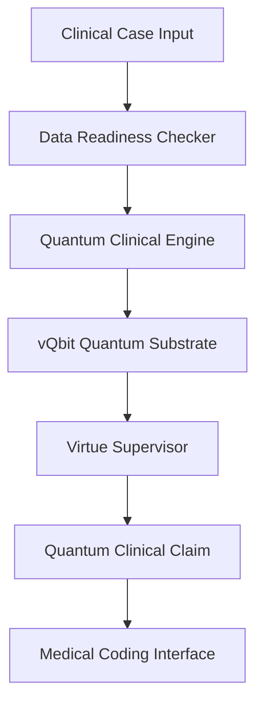

# 📚 FoTClinician API Documentation

## 🔬 Complete Technical Reference for Quantum Clinical Engine

---

## 📋 **Table of Contents**

1. [🏗️ System Architecture](#️-system-architecture)
2. [⚛️ Quantum Clinical Engine API](#️-quantum-clinical-engine-api)
3. [📊 Data Readiness Checker API](#-data-readiness-checker-api)
4. [🛡️ Virtue Supervisor API](#️-virtue-supervisor-api)
5. [🔗 Integration Examples](#-integration-examples)
6. [⚙️ Configuration Reference](#️-configuration-reference)

---

## 🏗️ **System Architecture**

### Core Components

```
FoTClinician/
├── core/
│   └── clinical/
│       ├── quantum_clinical_engine.py      # ⚛️ vQbit quantum substrate
│       ├── data_readiness_checker.py       # 📊 Clinical case validation
│       └── virtue_supervisor.py           # 🛡️ Ethical constraint engine
├── ontology/
│   ├── FoTClinical.ttl                     # 🧠 Clinical knowledge base
│   └── quantum_extensions.ttl              # ⚛️ Quantum entity definitions
├── tests/
│   ├── test_usmle_board_certification.py  # 🎓 Medical exam validation
│   └── test_quantum_clinical_validation.py # 🧪 Core functionality tests
└── streamlit_app.py                        # 🌐 Web interface
```

### Data Flow



---

## ⚛️ **Quantum Clinical Engine API**

### Main Classes

#### `QuantumClinicalEngine`

Core quantum computing engine implementing vQbit substrate for clinical reasoning.

**Constructor:**
```python
QuantumClinicalEngine(vqbit_dimension: int = 512)
```

**Parameters:**
- `vqbit_dimension` (int): Quantum state space dimension (default: 512)

**Key Methods:**

```python
def encode_clinical_case(self, clinical_data: Dict[str, Any]) -> QuantumClinicalCase:
    """Encode clinical case into quantum superposition state"""
    
def apply_virtue_supervision(self, quantum_case: QuantumClinicalCase) -> vQbitClinicalClaim:
    """Apply virtue-based constraints and collapse quantum state"""
```

#### `QuantumClinicalCase`

Represents a clinical case in quantum superposition state.

**Properties:**
```python
case_id: str                           # Unique case identifier  
vqbit_dimension: int                   # Quantum space dimension
quantum_state: complex                 # Current quantum state vector
symptom_qbits: Dict[str, complex]      # Symptom quantum bits
sign_qbits: Dict[str, complex]         # Clinical sign quantum bits  
differential_qbits: Dict[str, complex] # Diagnostic hypothesis quantum bits
decoherence_rate: float                # Quantum decoherence parameter
entanglement_correlations: np.ndarray  # Symptom-sign correlations
timestamp: datetime                    # Case processing timestamp
```

#### `vQbitClinicalClaim`

Represents quantum measurement result with virtue supervision context.

**Properties:**
```python
measurement_type: str           # Type of quantum measurement
quantum_state: QuantumClinicalState  # Result state (superposed/measured/collapsed)
amplitude: complex             # Quantum amplitude at measurement
probability: float             # Classical probability 
phase: float                   # Phase angle in degrees
entanglement_list: List[str]   # Entangled quantum states
collapse_policy: str           # Virtue supervisor policy applied  
uncertainty_hbar: float        # Quantum uncertainty measurement
toolchain_hash: str            # Validation hash of processing chain
timestamp: datetime           # Measurement timestamp
```

### Example Usage

```python
from core.clinical.quantum_clinical_engine import QuantumClinicalEngine

# Initialize quantum clinical engine
engine = QuantumClinicalEngine(vqbit_dimension=512)

# Define clinical case
clinical_case = {
    'case_id': 'QUANTUM_001',
    'chief_complaint': 'chest pain for 3 hours',
    'age': 65,
    'vital_signs': {
        'systolic_bp': 145,
        'heart_rate': 105,
        'temperature_c': 37.1
    },
    'symptoms': {
        'chest_pain': {'intensity': 0.9},
        'shortness_breath': {'intensity': 0.7}
    }
}

# Process with quantum engine
quantum_case = engine.encode_clinical_case(clinical_case)

# Apply virtue supervision  
quantum_claim = engine.apply_virtue_supervision(quantum_case)

# Access results
diagnoses = list(quantum_case.differential_qbits.keys())
probabilities = [abs(qb) for qb in quantum_case.differential_qbits.values()]

print(f"Superposed diagnoses: {diagnoses}")
print(f"Quantum state: {quantum_claim.quantum_state.value}")
```

---

## 📊 **Data Readiness Checker API**

### Main Class

#### `ClinicalDataReadinessChecker`

Validates clinical cases for sufficient data before quantum processing.

**Methods:**

```python
def check_readiness(self):
    """Check data readiness for various clinical tracks"""
    
def _validate_medication_safety(self, case: Dict[str, Any]) -> TrackValidationResult:
    """Validate medication safety track requirements"""
    
def _validate_triage_assessment(self, case: Dict[str, Any]) -> TrackValidationResult:
    """Validate triage assessment track requirements"""
    
def _validate_next_diagnostic_step(self, case: Dict[str, Any]) -> TrackValidationResult:
    """Validate next diagnostic step requirements"""
```

**Return Type:**

```python
class TrackValidationResult:
    track_name: str             # Track identifier
    result: str                 # READY or NOT_READY  
    gaps: List[DataGap]        # Identified data gaps
    actual_score: float        # Completeness score (0-100)
    validation_claim: str      # Human-readable validation summary
    ready_for_collapse: bool   # Quantum collapse readiness
```

### Example Usage

```python
from core.clinical.data_readiness_checker import ClinicalDataReadinessChecker

# Initialize data readiness checker
checker = ClinicalDataReadinessChecker()

# Define clinical case  
case_data = {
    'medications': [{'name': 'Aspirin', 'dose': '81mg'}],
    'allergies': [],
    'chief_complaint': 'chest pain',
    'vital_signs': {'systolic_bp': 140, 'heart_rate': 85},
    'age': 65
}

# Check data readiness
results = checker.check_readiness(case_data)

# Review validation results
for track_name, result in results.items():
    print(f"{track_name}: {result.result}")
    print(f"Completeness: {result.actual_score:.1f}%")
    
    if result.gaps:
        print("Gaps identified:")
        for gap in result.gaps:
            print(f"- {gap.field}: {gap.reason}")
```

---

## 🛡️ **Virtue Supervisor API**

### Cardinal Virtues

#### Virtue Enumeration

```python
class ClinicalVirtue(Enum):
    HONESTY = "honesty"              # Surface uncertainty genuinely
    PRUDENCE = "prudence"            # Default to safest options  
    JUSTICE = "justice"              # Fair resource allocation
    NON_MALEFICENCE = "non_maleficence"  # Prevent harm
```

#### Virtue Supervisor Class

```python
class QuantumVirtueSupervisor:
    """Manages ethical constraint enforcement during quantum collapse"""
    
    def enforce_virtues(self, quantum_state: QuantumClinicalCase) -> VirtueOutcome:
        """Apply virtue constraints to quantum clinical state"""
        
    def check_fidelity(self, virtue: ClinicalVirtue) -> float:
        """Measure fidelity to specific virtue"""
        
    def resolve_conflict(self, virtues: List[ClinicalVirtue]) -> ClinicalVirtue:
        """Resolve conflicts between virtues"""
```

### Example Usage

```python
from core.clinical.virtue_supervisor import QuantumVirtueSupervisor

# Initialize virtue supervisor
supervisor = QuantumVirtueSupervisor()

# Apply virtue supervision to quantum case
virtue_outcome = supervisor.enforce_virtues(quantum_case)

# Check virtue compliance
honesty_score = supervisor.check_fidelity(ClinicalVirtue.HONESTY)
prudence_score = supervisor.check_fidelity(ClinicalVirtue.PRUDENCE)

print(f"Honesty virtue score: {honesty_score:.3f}")
print(f"Prudence virtue score: {prudence_score:.3f}")
```

---

## 🔗 **Integration Examples**

### Streamlit Integration

```python
import streamlit as st
from core.clinical.quantum_clinical_engine import QuantumClinicalEngine

def streamlit_integration():
    """Example of integrating quantum clinical engine with Streamlit"""
    
    # Initialize quantum engine
    engine = QuantumClinicalEngine(vqbit_dimension=512)
    
    # Streamlit input
    case_data = {
        'chief_complaint': st.text_input('Chief Complaint'),
        'age': st.number_input('Age', min_value=0, max_value=120),
        'vital_signs': {
            'systolic_bp': st.number_input('Systolic BP'),
            'heart_rate': st.number_input('Heart Rate')
        }
    }
    
    if st.button('Analyze'):
        # Quantum analysis
        quantum_case = engine.encode_clinical_case(case_data)
        quantum_claim = engine.apply_virtue_supervision(quantum_case)
        
        # Display results
        diagnoses = list(quantum_case.differential_qbits.keys())
        st.write('Diagnoses:', diagnoses)
        st.write('Quantum state:', quantum_claim.quantum_state.value)
```

### REST API Integration

```python
from flask import Flask, request, jsonify
from core.clinical.quantum_clinical_engine import QuantumClinicalEngine

app = Flask(__name__)
engine = QuantumClinicalEngine()

@app.route('/analyze', methods=['POST'])
def analyze_case():
    """REST API endpoint for quantum clinical analysis"""
    
    try:
        # Get clinical case data
        case_data = request.get_json()
        
        # Process with quantum engine
        quantum_case = engine.encode_clinical_case(case_data)
        quantum_claim = engine.apply_virtue_supervision(quantum_case)
        
        # Return results
        return jsonify({
            'diagnoses': list(quantum_case.differential_qbits.keys()),
            'quantum_state': quantum_claim.quantum_state.value,
            'uncertainty': quantum_claim.uncertainty_hbar,
            'timestamp': quantum_claim.timestamp.isoformat()
        })
        
    except Exception as e:
        return jsonify({'error': str(e)}), 400
```

### CLI Integration

```python
import argparse
import json
from core.clinical.quantum_clinical_engine import QuantumClinicalEngine

def cli_integration():
    """Command-line interface for quantum clinical engine"""
    
    parser = argparse.ArgumentParser(description='Quantum Clinical Engine CLI')
    parser.add_argument('--case-file', required=True, help='JSON file with case data')
    parser.add_argument('--output-format', choices=['json', 'text'], default='json')
    
    args = parser.parse_args()
    
    # Load case data
    with open(args.case_file, 'r') as f:
        case_data = json.load(f)
    
    # Process case
    engine = QuantumClinicalEngine()
    quantum_case = engine.encode_clinical_case(case_data)
    quantum_claim = engine.apply_virtue_supervision(quantum_case)
    
    # Output results
    if args.output_format == 'json':
        print(json.dumps({
            'diagnoses': list(quantum_case.differential_qbits.keys()),
            'probabilities': [abs(qb) for qb in quantum_case.differential_qbits.values()],
            'quantum_state': quantum_claim.quantum_state.value
        }))
    else:
        print('Superposed Diagnoses:')
        for diagnosis, amplitude in quantum_case.differential_qbits.items():
            probability = abs(amplitude) ** 2
            print(f'- {diagnosis}: {probability:.3f}')

if __name__ == '__main__':
    cli_integration()
```

---

## ⚙️ **Configuration Reference**

### Environment Variables

```bash
# Quantum Engine Settings
export VQBIT_DIMENSION=512
export QUANTUM_DECOHERENCE_RATE=0.1
export VIRTUE_SUPERVISOR_ENABLED=true

# Validation Settings  
export USMLE_VALIDATION_MODE=strict
export SAFETY_PROTOCOL_LEVEL=maximum
export PASSING_THRESHOLD=0.85

# Medical Coding Settings
export ICD10_CODE_VERSION=2024
export CPT_CODE_VERSION=2024
export MEDICARE_FEE_SCHEDULE=true
```

### Configuration File

**File**: `config/quantum_config.yaml`

```yaml
quantum_engine:
  vqbit_dimension: 512
  decoherence_rate: 0.1
  entanglement_threshold: 0.001
  measurement_noise: 0.01

virtue_supervisor:
  enabled: true
  honesty_weight: 0.25
  prudence_weight: 0.25  
  justice_weight: 0.25
  non_maleficence_weight: 0.25
  conflict_resolution: "hierarchy"

validation:
  usmle_mode: strict
  passing_threshold: 0.85
  safety_level: maximum
  track_requirements:
    medication_safety: 5
    triage_assessment: 6
    next_diagnostic_step: 2

medical_coding:
  icd10_version: "2024"
  cpt_version: "2024"
  medicare_updates: true
  audit_logging: true
```

### Advanced Configuration

```python
# Custom quantum engine parameters
engine_config = {
    'vqbit_dimension': 1024,           # Higher resolution
    'decoherence_rate': 0.05,          # Lower uncertainty
    'entanglement_strategy': 'gradient', # Sophisticated coupling
    'measurement_fidelity': 0.99        # High precision
}

# Custom virtue weights
virtue_config = {
    'honesty_weight': 0.35,            # Emphasize uncertainty 
    'prudence_weight': 0.30,          # Safety priority
    'justice_weight': 0.20,           # Reduced fairness weight
    'non_maleficence_weight': 0.15    # Ensure safety baseline
}
```

---

## 📚 **Additional Resources**

### Testing Framework

```python
# Run comprehensive test suite
python -m pytest tests/ -v --cov=core.clinical

# Run specific USMLE certification tests
python tests/test_usmle_board_certification.py

# Validate quantum physics implementation
python tests/test_quantum_clinical_medical_validation.py
```

### Performance Monitoring

```python
# Enable quantum state logging
import logging
logging.basicConfig(level=logging.DEBUG)

# Monitor virtue compliance
from core.clinical.virtue_supervisor import enable_virtue_monitoring
enable_virtue_monitoring(log_level='INFO')

# Track quantum decoherence
from core.clinical.quantum_clinical_engine import enable_decoherence_tracking  
enable_decoherence_tracking()
```

### Medical Compliance

```python
# Validate against USMLE standards
from tests.test_usmle_board_certification import run_certification_suite
certification_status = run_certification_suite()

# Check medical safety protocols
from core.clinical.safety_validator import validate_safety_protocols
safety_status = validate_safety_protocols()
```

---

*🔬 API Documentation for FoTClinician Quantum Medical AI v1.0*

**© 2024 Fortress AI - Quantum Clinical Intelligence Framework**
